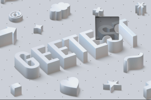

# Puzzle Captcha Solver 🧩🧩

PuzzleCaptchaSolver is a Python project designed to solve various puzzle CAPTCHAs such as Geetest3, Geetest4, Binance, DataDome, TikTok, and others. This project leverages OpenCV to process images and identify the position of the puzzle piece (slide) within the background image.

## Sponsors
<div align="center">
  <a href="https://www.sadcaptcha.com?ref=vsmutok" target="_blank">
    
    
    
    
    <br/>
    <div>
         <strong> Bypass any TikTok captcha </strong> in just two lines of code.<br> Scale your TikTok automation and get unblocked with SadCaptcha.
    </div>
  </a>
</div>

## Features

- **Whitespace Removal:** Automatically crops the image to remove any unnecessary whitespace.
- **Edge Detection:** Highlights the edges of images to improve the accuracy of template matching.
- **Slide Positioning:** Accurately finds and marks the position of the puzzle piece within the background image.

## Installation

1. Clone the repository:
   ```sh
   git clone https://github.com/vsmutok/Puzzle-Captcha-Solver.git
   cd Puzzle-Captcha-Solver
   ```
2. Create and activate virtual environment:
   ```sh
   python3 -m venv .venv
   source .venv/bin/activate
   ```
3. Install the required dependencies:
   ```sh
   pip install -r requirements.txt
   ```


## Usage

The primary class in this project is `PuzzleCaptchaSolver`. Here's how you can use it:

1. **Initialization:** Create an instance of `PuzzleCaptchaSolver` by providing the paths to the gap image, background image, and the output image path.

2. **Discern:** Call the `discern` method to process the images and find the position of the slide.

### Example

```python
from PuzzleCaptchaSolver import PuzzleCaptchaSolver

if __name__ == "__main__":
    solver = PuzzleCaptchaSolver(
        gap_image_path="demo/geetest4/1_slice.png",
        bg_image_path="demo/geetest4/1_bg.png",
        output_image_path="demo/geetest4/1_result.png"
    )
    position = solver.discern()
    print(f"The position of the slide is: {position}")
```

**Input Images**:
- Background Image
> 
- Slide Image
>

**Output Image**:
> 

In the resulting image, the detected position of the sliding piece is highlighted with a red rectangle.


### Methods

- `remove_whitespace(image)`: Removes whitespace from an image.
- `apply_edge_detection(img)`: Applies edge detection on the given image.
- `find_position_of_slide(slide_pic, background_pic)`: Finds the position of the slide on the background picture.
- `discern()`: Performs the full discernment process to find the position of the slide in the given images.

## Contributing

Contributions are welcome! If you have any suggestions, feel free to open an issue or create a pull request.

## License

This project is licensed under the MIT License. See the [LICENSE](LICENSE) file for more details.

## Acknowledgements

- [OpenCV](https://opencv.org/) for their powerful image processing library.

---

By using this project, you can efficiently solve various puzzle CAPTCHAs, making it easier to automate interactions with websites that use these types of verifications.

___
#### Disclaimer

_This repository is created for informational purposes only. I do not advise or condone violating the policies of any website._

